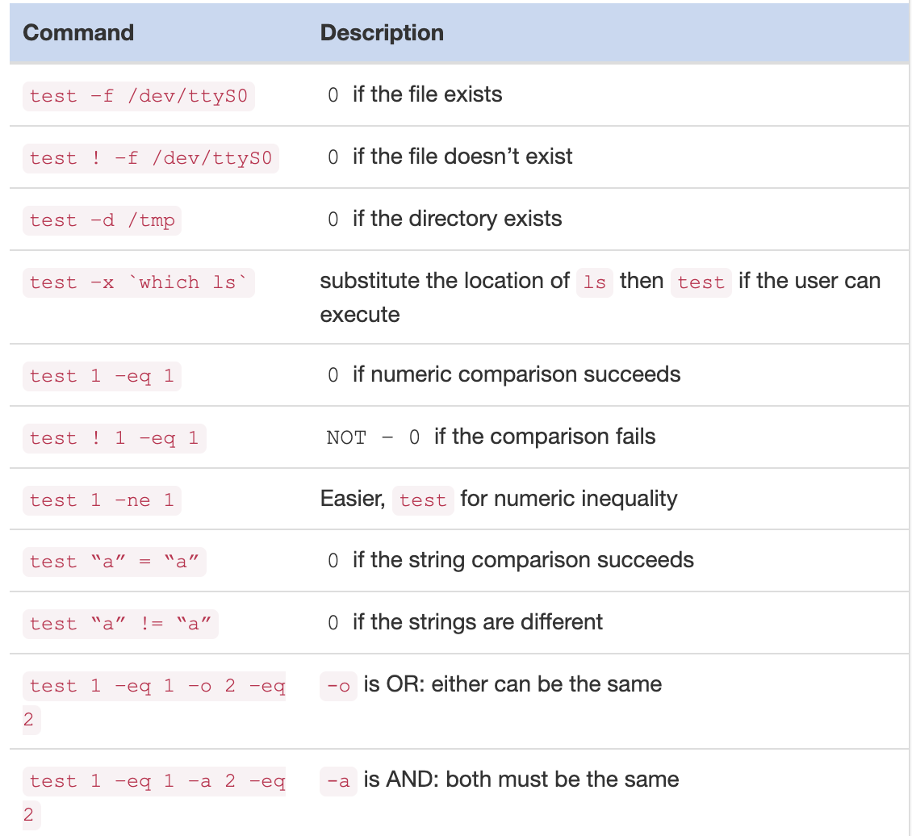

# Basic Scripting

This section introduces basic scripting concepts in Linux, including using text editors, handling variables, writing conditionals, and creating loops. You'll learn how to automate tasks with simple Bash scripts and how to control script execution flow.

## Table of Contents

- [Text Editors](#text-editors)
  - [GNU Nano Editor](#gnu-nano-editor)
- [Variables](#variables)
- [Conditionals](#conditionals)
  - [If Statements](#if-statements)
  - [Test Command](#test-command)
  - [Case Statements](#case-statements)
- [Loops](#loops)
  - [For Loop](#for-loop)
  - [While Loop](#while-loop)

---

## Text Editors

### GNU Nano Editor

UNIX has many text editors. The merits of one over the other are often hotly debated. Two are specifically mentioned in the LPI Essentials syllabus: The GNU nano editor is a very simple editor well suited to editing small text files. The Visual Editor, `vi`, or its newer version, VI improved (`vim`), is a remarkably powerful editor but has a steep learning curve. We’ll focus on `nano`.

- Press **Control and K** twice to cut the last two lines to the copy buffer.
- Press **Control and U** once to paste the copy buffer to the current position.

Type `nano test.sh` and you’ll see a screen similar to this:

Other helpful commands you might need are:


## Variables

Variables are a key part of any programming language. A very simple use of variables is shown here:
```bash
#!/bin/bash

ANIMAL="penguin"
echo "My favorite animal is a $ANIMAL"
```

It is important that there are no spaces between the name of the variable, the equals sign, and the item to be assigned to the variable. If you have a space there, you will get an odd error such as “command not found”. Capitalizing the name of the variable is not necessary but it is a useful convention to separate variables from commands to be executed.

It is possible to get input from the user of your script and assign it to a variable through the `read` command:

```bash
#!/bin/bash

echo -n "What is your name? "
read NAME
echo "Hello $NAME!"
```

The `read` command can accept a string right from the keyboard or as part of command redirection.

There are some special variables in addition to the ones you set. You can pass arguments to your script:

```bash
#!/bin/bash
echo "Hello $1"
```

A dollar **$** sign followed by a number N corresponds to the Nth argument passed to the script. If you call the example above with `./test.sh World` the output will be **Hello World**. The **$0** variable contains the name of the script itself.

After a program runs, be it a binary or a script, it returns an exit code which is an integer between 0 and 255. You can test this through the **$**? variable to see if the previous command completed successfully.
```bash
sysadmin@localhost:~$ grep -q root /etc/passwd
sysadmin@localhost:~$ echo $?
0
sysadmin@localhost:~$ grep -q slartibartfast /etc/passwd
sysadmin@localhost:~$ echo $?
1
```

The `grep` command was used to look for a string within a file with the `–q` flag, which means “quiet”. The `grep,` while running in quiet mode, returns **0** if the string was found and **1** otherwise. This information can be used in a conditional to perform an action based on the output of another command.

```bash
#!/bin/bash
# Something bad happened!
exit 1
```
The `exit 1` returns exit code 1 to the caller. This even works in the shell, if you run this script from the command line and then type `echo $?` you will see it returns **1**.

By convention, an exit code of **0** means **“everything is OK”**. Any exit codes greater than 0 mean some kind of error happened, which is specific to the program.

## Conditionals 

A basic if statement looks like this:
```bash
if somecommand; then
  # do this if somecommand has an exit code of 0
fi
```
The next example will run “somecommand” (actually, everything up to the semicolon) and if the exit code is 0 then the contents up until the closing fi will be run. Using what you know about `grep`, you can now write a script that does different things based on the presence of a string in the password file:
```bash
#!/bin/bash

if grep -q root /etc/passwd; then
  echo root is in the password file
else
  echo root is missing from the password file
fi
```
The exit code of `grep` is 0 if the string is found. The example above uses this in one line to print a message if root is in the password file or a different message if it isn’t. The difference here is that instead of an fi to close off the if block, there’s an else. This lets you do one action if the condition is true, and another if the condition is false. The else block must still be closed with the fi keyword.

The `test` command gives you easy access to comparison and file test operators. For example:


It is important to note that `test` looks at integer and string comparisons differently. 01 and 1 are the same by numeric comparison, but not by string comparison. You must always be careful to remember what kind of input you expect.

`test` is fairly verbose for a command that gets used so frequently, so there is an alias for it called [ (left square bracket). If you enclose your conditions in square brackets, it’s the same as running test. So, these statements are identical.

```bash
if test –f /tmp/foo; then
if [ -f /tmp/foo]; then
```

The `if/elif/else` tests can become quite verbose and complicated. The `case` statement provides a different way of making multiple tests easier.
```bash
#!/bin/bash

case "$1" in
hello|hi)
  echo "hello yourself"
  ;;
goodbye)
  echo "nice to have met you"
  echo "I hope to see you again"
  ;;
*)
  echo "I didn't understand that"
esac

```

## Loops
Loops allow code to be executed repeatedly. There are two main loops in shell scripts: the `for` loop and the `while` loop.
```bash
#!/bin/bash

SERVERS="servera serverb serverc"
for S in $SERVERS; do
  echo "Doing something to $S"
done
```

```bash
#!/bin/bash

i=0
while [ $i -lt 10 ]; do
  echo $i
  i=$(( $i + 1))
done
echo “Done counting”
```

The example above shows a `while` loop that counts from 0 to 9. A counter variable, i, is initialized to 0. Then a while loop is run with the test being **“is $i less than 10?”** Note that the while loop uses the same notation as an if statement!

Within the while loop the current value of i is echoed and then 1 is added to it through the $(( arithmetic )) command and assigned back into i. Once i becomes 10 the while statement returns false and processing continues after the loop.


