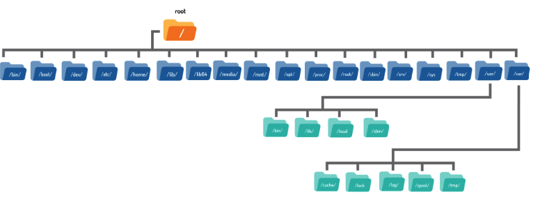
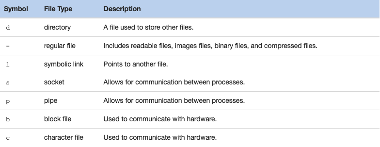

# Navigating the Filesystem

## Table of Contents

- [Home Directory](#home-directory)
- [Current Directory](#current-directory)
- [Changing Directory](#changing-directory)
- [Absolute Paths](#absolute-paths)
- [Relative Paths](#relative-paths)
- [Shortcuts](#shortcuts)
- [Listing Files in a Directory](#listing-files-in-directory)
  - [Listing Hidden Files](#listing-hidden-files)
  - [Long Display Listing](#long-display-listing)
  - [Human-Readable Sizes](#human-readable-sizes)
  - [Listing Directories](#listing-directories)
  - [Recursive Listing](#recursive-listing)
  - [Sort a Listing](#sort-a-listing)
- [File Globbing](#file-globbing)
  - [Matching Any Characters](#matching-any-characters)
  - [Matching One Character](#matching-one-character)
  - [Matching Specific Characters](#matching-specific-characters)
---

This section provides an overview of the Linux filesystem and commands to navigate and manage it effectively. It covers essential topics like understanding directories, navigating using `cd` and paths, listing files with the `ls` command, and leveraging advanced listing options like recursive and sorted listings. You'll also learn about file globbing and shortcuts to enhance efficiency when navigating the filesystem.

The following image shows a visual representation of a typical Linux filesystem:



### Home Directory
Under this `/home` directory there is a directory for each user on the system. The directory name is the same as the name of the user, so a user named `sysadmin` would have a home directory called `/home/sysadmin`. 

The home directory is one of the few directories where the user has full control to create and delete additional files and directories. 

It is also possible to refer to another user's home directory by using the tilde ~ character followed by the name of the user account. For example, `~bob` would be the equivalent of /home/bob.

### Current Directory

To determine where the user is currently located within the filesystem, the `pwd` (print working directory) command can be used:

```bash
sysadmin@localhost:~$ pwd
/home/sysadmin
```

### Changing Directory

To navigate the filesystem, use the `cd` (change directory) command.

```bash
sysadmin@localhost:~$ cd Documents
sysadmin@localhost:~/Documents$
```
When used with no arguments, the cd command will take the user to their home directory.

### Absolute Paths

Absolute paths allow the user to specify the exact location of a directory. It always starts at the root directory, and therefore it always begins with the `/` character. The path `/home/sysadmin` is an absolute path; it tells the system to begin at the root `/` directory, move into the `home` directory, and then into the `sysadmin` directory.

### Relative Paths

Relative paths start from the current directory. A relative path gives directions to a file relative to the current location in the filesystem. They do not start with the `/` character. Instead, they start with the name of a directory. More specifically, relative paths start with the name of a directory contained within the current directory.

### Shortcuts

Regardless of which directory the user is in, two period `..` characters always represents one directory higher relative to the current directory, sometimes referred to as the parent directory.

Regardless of which directory the user is in, the single period `.` character always represents the current directory.

### Listing Files in Directory

**ls** command is used to display the contents of a directory and can provide detailed information about the files

```bash
sysadmin@localhost:~$ ls                                               
Desktop  Documents  Downloads  Music  Pictures  Public  Templates  Videos
```

```bash
sysadmin@localhost:~$ ls /var                                                   
backups  cache  lib  local  lock  log  mail  opt  run  spool  tmp 
```

#### Listing Hidden files

To display all files, including hidden files, use the **-a** option to the `ls` command:

```bash
sysadmin@localhost:~$ ls -a                                            
.             .bashrc   .selected_editor  Downloads  Public           
..            .cache    Desktop           Music      Templates         
.bash_logout  .profile  Documents         Pictures   Videos
```
#### Long Display Listing 
Each file has details associated with it called metadata. This can include information such as the size, ownership, or timestamps. To view this information, use the **-l** option to the `ls` command.

**File Type** 
The first character of each line indicates the type of file. The file types are:


**Permissions** 
The next nine characters demonstrate the permissions of the file. Permissions indicate how certain users can access a file.

**Hard Link Count**
This number indicates how many hard links point to this file.

**User Owner** 
Every file is owned by a user account. This is important because the owner has the rights to set permissions on a file.

**Group Owner** 
Indicates which group owns this file. This is important because any member of this group has a set of permissions on the file.

**File Size** 
Displays the size of the file in bytes. Ignore this field for directories.

**Timestamp** 
Indicates the time that the file's contents were last modified. For directories, this timestamp indicates the last time a file was added or deleted from the directory.

**File Name** 
The final field contains the name of the file or directory.

#### Human-Readable Sizes

The **-l** option to the `ls` command displays file sizes in bytes. For text files, a byte is 1 character. For smaller files, byte sizes are fine. However, for larger files, it is hard to comprehend how large the file is.

Sometimes it is preferable to present the file size in a more human-readable size, like megabytes or gigabytes. To accomplish this, add the **-h** option to the `ls` command:
```bash
sysadmin@localhost:~$ ls -lh /var/log/lastlog                                   
-rw-rw-r-- 1 root utmp 286K Dec 15 16:38 /var/log/lastlog
```

#### Listing Directories
When the **-d** option is used, it refers to the current directory, and not the contents within it. 

To use the **-d** option in a meaningful way requires the addition of the **-l** option.

```bash
sysadmin@localhost:~$ ls -ld                                           
drwxr-xr-x 1 sysadmin sysadmin 224 Nov  7 17:07 .
```

#### Recursive Listing
Displays all of the files in a directory as well as all of the files in all subdirectories under that directory.

To perform a recursive listing, use the **-R** option to the `ls` command:
```bash
sysadmin@localhost:~$ ls -R /etc/ppp
/etc/ppp:
ip-down.d  ip-up.d         

/etc/ppp/ip-down.d:
bind9

/etc/ppp/ip-up.d:
bind9
```

#### Sort a Listing
By default, the `ls` command sorts files alphabetically by file name.

To sort files by size, we can use the **-S** option. It is most useful when used with the **-l** option so the file sizes are visible. It may also be useful to use the **-h** option to display human-readable file sizes. 
```bash
sysadmin@localhost:~$ ls -lSh /etc/ssh                                
total 580K                                                                      
-rw-r--r-- 1 root root 541K Feb 10  2018 moduli
-rw-r--r-- 1 root root 3.2K Feb 10  2018 sshd_config
-rw------- 1 root root 1.7K Jul 19 06:52 ssh_host_rsa_key
-rw-r--r-- 1 root root 1.6K Feb 10  2018 ssh_config
-rw------- 1 root root  411 Jul 19 06:52 ssh_host_ed25519_key
-rw-r--r-- 1 root root  399 Jul 19 06:52 ssh_host_rsa_key.pub
-rw-r--r-- 1 root root  338 Jul 19 06:52 ssh_import_id
-rw------- 1 root root  227 Jul 19 06:52 ssh_host_ecdsa_key
-rw-r--r-- 1 root root  179 Jul 19 06:52 ssh_host_ecdsa_key.pub
-rw-r--r-- 1 root root   99 Jul 19 06:52 ssh_host_ed25519_key.pub
```

The **-** option sorts files based on the time they were modified. It will list the most recently modified files first. This option can be used alone, but again, is usually more helpful when paired with the **-l** option.
For more detailed modification time information you can use the **--full-time** option to display the complete timestamp (including hours, minutes, seconds). It will assume the **-l** option automatically.

```bash
sysadmin@localhost:~$ ls -t --full-time /etc/ssh
total 580
-rw------- 1 root root    227 2018-07-19 06:52:16.000000000 +0000 ssh_host_ecdsa_key
-rw-r--r-- 1 root root    179 2018-07-19 06:52:16.000000000 +0000 ssh_host_ecdsa_key.pub
-rw------- 1 root root    411 2018-07-19 06:52:16.000000000 +0000 ssh_host_ed25519_key
-rw-r--r-- 1 root root     99 2018-07-19 06:52:16.000000000 +0000 ssh_host_ed25519_key.pub
-rw------- 1 root root   1679 2018-07-19 06:52:16.000000000 +0000 ssh_host_rsa_key
-rw-r--r-- 1 root root    399 2018-07-19 06:52:16.000000000 +0000 ssh_host_rsa_key.pub
-rw-r--r-- 1 root root    338 2018-07-19 06:52:16.000000000 +0000 ssh_import_id
-rw-r--r-- 1 root root 553122 2018-02-10 02:31:46.000000000 +0000 moduli
-rw-r--r-- 1 root root   1580 2018-02-10 02:31:46.000000000 +0000 ssh_config
-rw-r--r-- 1 root root   3264 2018-02-10 02:31:46.000000000 +0000 sshd_config
```

It is possible to perform a reverse sort by using the **-r** option. It can be used alone, or combined with either the **-S** or **-t** options. The following command will sort files by size, smallest to largest:

```bash
sysadmin@localhost:~$ ls -lrS /etc/ssh
total 580
-rw-r--r-- 1 root root     99 Jul 19 06:52 ssh_host_ed25519_key.pub
-rw-r--r-- 1 root root    179 Jul 19 06:52 ssh_host_ecdsa_key.pub
-rw------- 1 root root    227 Jul 19 06:52 ssh_host_ecdsa_key
-rw-r--r-- 1 root root    338 Jul 19 06:52 ssh_import_id
-rw-r--r-- 1 root root    399 Jul 19 06:52 ssh_host_rsa_key.pub
-rw------- 1 root root    411 Jul 19 06:52 ssh_host_ed25519_key
-rw-r--r-- 1 root root   1580 Feb 10  2018 ssh_config
-rw------- 1 root root   1679 Jul 19 06:52 ssh_host_rsa_key
-rw-r--r-- 1 root root   3264 Feb 10  2018 sshd_config
-rw-r--r-- 1 root root 553122 Feb 10  2018 moduli 
```

### File Globbing

#### Matching Any Characters
You can use file globbing (wildcards) to limit which files or directories you see. For example, the * character can match "zero or more of any characters" in a filename. Execute the following command to display only the files that begin with the letter `s` in the **/etc** directory:

```bash
sysadmin@localhost:~$ ls -d /etc/s*                                           
/etc/securetty  /etc/sgml     /etc/shells  /etc/ssl        /etc/sysctl.conf   
/etc/security   /etc/shadow   /etc/skel    /etc/sudoers    /etc/sysctl.d      
/etc/services   /etc/shadow-  /etc/ssh     /etc/sudoers.d  /etc/systemd       
sysadmin@localhost:~$
```

Note that the **-d** option prevents files from subdirectories from being displayed. It should always be used with the `ls` command when you are using file globbing.

#### Matching One Character

The **?** character can be used to match exactly 1 character in a file name. Execute the following command to display all of the files in the **/etc** directory that are exactly four characters long. 

```bash
sysadmin@localhost:~$ ls -d /etc/????                                         
/etc/bind  /etc/init  /etc/motd  /etc/perl  /etc/skel                         
/etc/dpkg  /etc/ldap  /etc/mtab  /etc/sgml  /etc/udev   
```

#### Matching Specific Characters
By using square brackets **[ ]** you can specify a single character to match from a set of characters. Execute the following command to display all of the files in the /etc directory that begin with the letters a, b, c or d:
```bash
sysadmin@localhost:~$ ls -d /etc/[abcd]*                                      
/etc/adduser.conf            /etc/blkid.conf            /etc/cron.weekly      
/etc/adjtime                 /etc/blkid.tab             /etc/crontab          
/etc/alternatives            /etc/ca-certificates       /etc/dbus-1           
/etc/apparmor.d              /etc/ca-certificates.conf  /etc/debconf.conf     
/etc/apt                     /etc/calendar              /etc/debian_version   
/etc/bash.bashrc             /etc/cron.d                /etc/default          
/etc/bash_completion.d       /etc/cron.daily            /etc/deluser.conf     
/etc/bind                    /etc/cron.hourly           /etc/depmod.d         
/etc/bindresvport.blacklist  /etc/cron.monthly          /etc/dpkg    
```