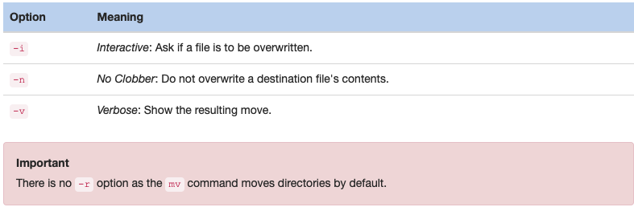

# Managing Files and Directories

This section provides a comprehensive guide to managing files and directories in Linux. It covers essential commands for copying, moving, creating, and deleting files and directories. Additionally, it explains advanced globbing techniques for pattern matching and provides options to safeguard operations like copying and deleting to avoid accidental data loss.

## Table of Contents

- [Globbing](#globbing)
  - [Asterisk (*) Character](#asterisk--character)
  - [Question Mark (?) Character](#question-mark--character)
  - [Bracket ([ ]) Characters](#bracket--characters)
  - [Exclamation Point (!) Character](#exclamation-point--character)
- [Copying Files](#copying-files)
  - [Verbose Mode](#verbose-mode)
  - [Avoid Overwriting Data](#avoid-overwriting-data)
  - [Copying Directories](#copying-directories)
- [Moving Files](#moving-files)
  - [Renaming Files](#renaming-files)
  - [Additional Move Options](#additional-move-options)
- [Creating Files](#creating-files)
- [Removing Files](#removing-files)
  - [Removing Directories](#removing-directories)
- [Creating Directories](#creating-directories)

---

### Globing 

Can be used with any command

#### Asterix * Character 

```bash
sysadmin@localhost:~$ echo /etc/t*                              
/etc/terminfo /etc/timezone /etc/tmpfiles.d
```

The pattern **t*** matches any file in the /etc directory that begins with the character t followed by zero or more of any character. In other words, any files that begin with the letter `t`.

```bash
sysadmin@localhost:~$ echo /etc/*.d  
sysadmin@localhost:~$ echo /etc/r*.conf 
```

#### Question Mark ? Character 

Suppose you want to display all of the files in the /etc directory that begin with the letter t and have exactly 7 characters after the `t` character:

```bash
sysadmin@localhost:~$ echo /etc/t???????      
/etc/terminfo /etc/timezone
```

Glob characters can be used together to find even more complex patterns. 

```bash
sysadmin@localhost:~$ echo /etc/*????????????????????  
/etc/bindresvport.blacklist /etc/ca-certificates.conf
```

```bash
sysadmin@localhost:~$ echo /etc/*.???                
/etc/issue.net /etc/locale.gen
```

#### Bracket [] Characters 

The bracket **[]** characters are used to match a single character by representing a range of characters that are possible match characters. For example, the `/etc/[gu]*` pattern matches any file that begins with either a `g` or `u` character and contains zero or more additional characters:
```bash
sysadmin@localhost:~$ echo /etc/[gu]*                              
/etc/gai.conf /etc/groff /etc/group /etc/group- /etc/gshadow /etc/gshadow- /etc/
gss /etc/ucf.conf /etc/udev /etc/ufw /etc/update-motd.d /etc/updatedb.conf 
```

Brackets can also be used to a represent a range of characters. For example, the `/etc/[a-d]*` pattern matches all files that begin with any letter between and including `a` and `d`.

The `/etc/*[0-9]*` pattern displays any file that contains at least one number.

#### Exclamation Point ! Character

The exclamation point ! character is used in conjunction with the square brackets to negate a range. For example, the pattern `/etc/[!DP]*` matches any file that does not begin with a `D` or `P`.

---

Always use the `-d` option with globs, which tells the ls command to display the name of directories, instead of their contents. 

### Copying Files

The `cp` command is used to copy files. It requires a source and a destination. 

The following command copies the /etc/hosts file to your home directory:

```bash
sysadmin@localhost:~$ cp /etc/hosts ~                                     
sysadmin@localhost:~$ ls
Desktop    Downloads  Pictures  Templates  hosts                          
Documents  Music      Public    Videos      
```

#### Verbose Mode

The `-v` option causes the cp command to produce output if successful. The `-v` option stands for verbose:

```bash
sysadmin@localhost:~$ cp -v /etc/hosts ~                              
`/etc/hosts' -> `/home/sysadmin/hosts'
```

#### Avoid Overwriting Data

The `cp` command can be destructive to existing data if the destination file already exists. In the case where the destination file exists, the `cp` command overwrites the existing file's contents with the contents of the source file.

Two options can be used to safeguard against accidental overwrites. With the **-i** interactive option, the cp command prompts the user before overwriting a file. The **-i** option requires you to answer y or n for every copy that could end up overwriting an existing file's contents. This can be tedious when a bunch of overwrites occur.

To answer `n` to each prompt automatically, use the **-n** option. It stands for no clobber, or no overwrite.

#### Copying Directories

By default, the `cp` command will not copy directories; any attempt to do so results in an error message. 

However, the recursive ***-r*** option allows the cp command to copy both files and directories.

```
cp -r source_directory destination_directory
```

### Moving Files
To move a file, use the `mv` command. The syntax for the mv command is much like the `cp` command:
```
mv source destination
```
When a file is moved, the file is removed from the original location and placed in a new location. Moving files can be somewhat tricky in Linux because users need specific permissions to remove files from a directory. Without the right permissions, a Permission denied error message is returned. 

#### Renaming Files

The `mv` command is not just used to move a file, but also to rename a file. If the destination for the `mv` command is a directory, the file is moved to the directory specified. The name of the file only changes if a destination file name is also specified.

If a destination directory is not specified, the file is renamed using the destination file name and remains in the source directory. For example, the following commands renames the `newexample.txt` file to `myfile.txt`.

```bash
sysadmin@localhost:~$ cd Videos                                        
sysadmin@localhost:~/Videos$ ls                                        
hosts  newexample.txt                                                  
sysadmin@localhost:~/Videos$ mv newexample.txt myfile.txt           
sysadmin@localhost:~/Videos$ ls
hosts  myfile.txt
```

#### Additional Move Options

Like the `cp` command, the `mv` command provides the following options. 



There is no ***-r*** option as the mv command moves directories by default.

### Creating Files

To create an empty file, use the `touch` command as demonstrated below:

```bash
sysadmin@localhost:~$ touch sample                                     
sysadmin@localhost:~$ ls -l sample                                     
-rw-rw-r-- 1 sysadmin sysadmin 0 Nov  9 16:48 sample
```

### Removing Files

To delete a file, use the `rm` command:
```bash
sysadmin@localhost:~$ ls                                               
Desktop    Downloads  Pictures  Templates  hosts.copy                           
Documents  Music      Public    Videos     sample                         
sysadmin@localhost:~$ rm sample    
sysadmin@localhost:~$ rm hosts.copy                                    
sysadmin@localhost:~$ ls
Desktop  Documents  Downloads  Music  Pictures  Public  Templates  Videos 
```
Note that the files were deleted with no questions asked. This could cause problems when deleting multiple files by using glob characters.

```
The files are permanently deleted. There is no command to undelete a file and no trash can from which to recover deleted files.
```

As a precaution, users should use the **-i** option when deleting multiple files. 

#### Removing Directories

To delete a directory with the `rm` command, use the ***-r*** recursive option. 

```
When a user deletes a directory, all of the files and subdirectories are deleted without any interactive question. It is best to use the -i option with the rm command.
```

You can also delete a directory with the `rmdir` command, but only if the directory is empty.


### Creating Directories

To create a directory, use the `mkdir` command. 

