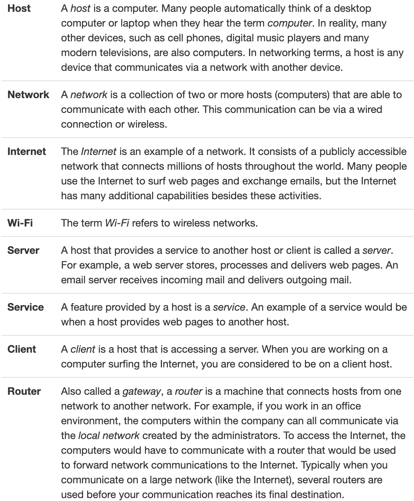
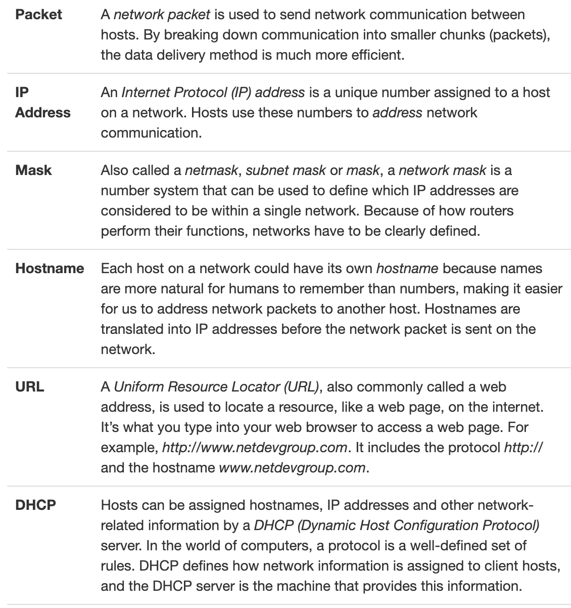
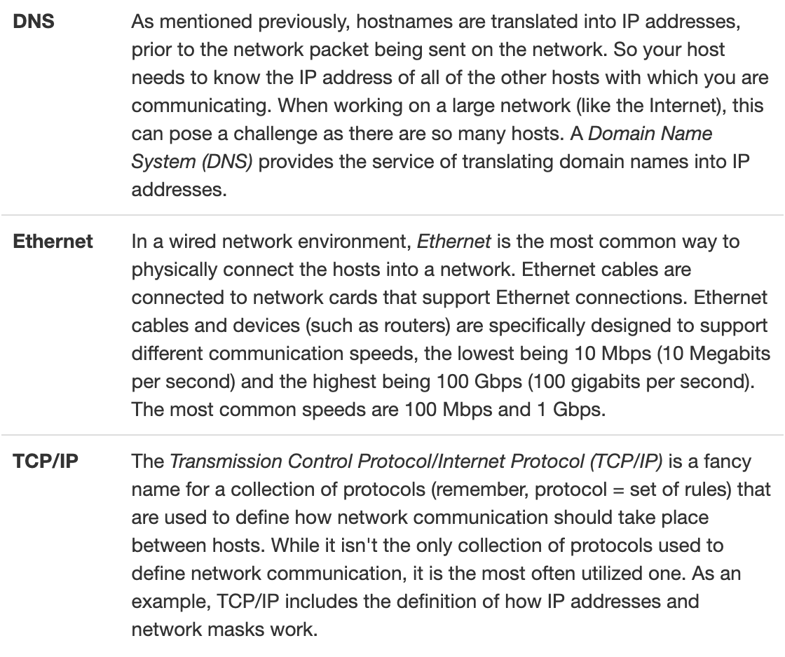

# Network Configuration

## Basic Network Terminology 


## Networking Features Terminology




## IP Addresses

There are, in fact, two different types of IP addresses: **IPv4** and **IPv6**. 

For many years, the IP addressing technique that was used by all computers was IPv4. In an IPv4 address, a total of four 8-bit numbers are used to define the address. This is considered a 32-bit address (4 x 8 = 32). For example: 

```
192.168.10.120
```
**8-bit refers to numbers from 0 to 255.**

IPv6 was officially created in 1998. In an IPv6 network the addresses are much larger, 128-bit addresses that look like this:
```
2001:0db8:85a3:0042:1000:8a2e:0370:7334
```

There are primarily two reasons why 98%-99% of all devices uses IPv4:
- **NAT:** Net Address Translation (NAT) used a technique to provide more hosts access to the Internet. A group of hosts is placed into a private network with no direct access to the Internet; a special router provides Internet access, and only this one router needs an IP address to communicate on the Internet. In other words, a group of hosts shares a single IP address, meaning a lot more computers can attach to the Internet. This feature means the need to move to IPv6 is less critical than before the invention of NAT.
- **Porting:** Porting is switching over from one technology to another. IPv6 has a lot of great new features, but all of the hosts need to be able to utilize these features. Getting everyone on the Internet (or even just some) to make these changes poses a challenge.

## Configuring Network Devices
### Domain Name System (DNS)

For the computer to associate an IP address with the URL or hostname request, the computer relies upon the DNS service of another computer. Often, the IP address of the DNS server is discovered during the DHCP request, while a computer is receiving important addressing information to communicate on the network.

The address of the DNS server is stored in the `/etc/resolv.conf` file. A typical `/etc/resolv.conf` file is automatically generated and looks like the following:
```bash
sysadmin@localhost:~$ cat /etc/resolv.conf                     
nameserver 127.0.0.1 
```
The nameserver setting is often set to the IP address of the DNS server. The following example uses the host command, which works with DNS to associate a hostname with an IP address. 
```bash
sysadmin@localhost:~$ host example.com                         
example.com has address 192.168.1.2    
```

### Network Configuration Files

Name resolution on a Linux host is accomplished by 3 critical files: the `/etc/hosts`, `/etc/resolv.conf` and `/etc/nsswitch`.conf files. Together, they describe the location of name service information, the order in which to check resources, and where to go for that information.

Files: 
1. /etc/hosts 
    - This file contains a table of hostnames to IP addresses. It can be used to supplement a DNS server.
```bash
sysadmin@localhost:~$ cat /etc/hosts  
127.0.0.1       localhost
```
2. /etc/resolv.conf
    - This file contains the IP addresses of the name servers the system should consult in any attempt to resolve names to IP addresses. These servers are often DNS servers. It also can contain additional keywords and values that can affect the resolution process.
```bash
sysadmin@localhost:~$ cat /etc/resolv.conf  
nameserver 127.0.0.11
```
3. /etc/nsswitch.conf
    - This file can be used to modify where hostname lookups occur. It contains a particular entry that describes in what order name resolution sources are consulted.
```bash
sysadmin@localhost:~$ cat /etc/nsswitch.conf 
# /etc/nsswitch.conf
# 

Output Omitted...

hosts:          files dns

Output Omitted...
```
The /etc/hosts file is searched first, the DNS server second:
```
hosts: files dns 
```
The DNS server would be searched first, local files second:
```
hosts: dns files
```

## Network Tools 

### The ifconfig Command
The `ifconfig` command stands for interface configuration and is used to display network configuration information. It is important to note from the output below that the IP address of the primary network device eth0 is 192.168.1.2 and that the device is currently active UP:
```bash
root@localhost:~# ifconfig                                     
eth0      Link encap:Ethernet  HWaddr b6:84:ab:e9:8f:0a    
          inet addr:192.168.1.2  Bcast:0.0.0.0  Mask:255.255.255.0  
          inet6 addr: fe80::b484:abff:fee9:8f0a/64 Scope:Link       
          UP BROADCAST RUNNING MULTICAST  MTU:1500  Metric:1        
          RX packets:95 errors:0 dropped:4 overruns:0 frame:0       
          TX packets:9 errors:0 dropped:0 overruns:0 carrier:0      
          collisions:0 txqueuelen:1000                              
          RX bytes:25306 (25.3 KB)  TX bytes:690 (690.0 B)          
lo        Link encap:Local Loopback                               
          inet addr:127.0.0.1  Mask:255.0.0.0                       
          inet6 addr: ::1/128 Scope:Host                           
          UP LOOPBACK RUNNING  MTU:65536  Metric:1                  
          RX packets:6 errors:0 dropped:0 overruns:0 frame:0        
          TX packets:6 errors:0 dropped:0 overruns:0 carrier:0      
          collisions:0 txqueuelen:0                                 
          RX bytes:460 (460.0 B)  TX bytes:460 (460.0 B)
```
The `ifconfig` command can also be used to modify network settings temporarily. Typically these changes should be permanent, so using the `ifconfig` command to make such changes is relatively rare.

### The ip Command

The `ifconfig` command is becoming obsolete in some Linux distributions (deprecated) and is being replaced with a form of the `ip` command, specifically `ip addr show`.

```bash
root@localhost:~# ip addr show
1: lo: <LOOPBACK,UP,LOWER_UP> mtu 65536 qdisc noqueue state UNKNOWN group default qlen 1
    link/loopback 00:00:00:00:00:00 brd 00:00:00:00:00:00
    inet 127.0.0.1/8 scope host lo
       valid_lft forever preferred_lft forever
    inet6 ::1/128 scope host 
       valid_lft forever preferred_lft forever
2: eth0: <BROADCAST,MULTICAST,UP,LOWER_UP> mtu 1500 qdisc pfifo_fast state UP group default qlen 1000
    link/ether 00:0c:29:71:f0:bb brd ff:ff:ff:ff:ff:ff
    inet 172.16.241.140/24 brd 172.16.241.255 scope global eth0
       valid_lft forever preferred_lft forever
    inet6 fe80::20c:29ff:fe71:f0bb/64 scope link 
       valid_lft forever preferred_lft forever
```

### The ping Command

The `ping` command can be used to determine if another machine is reachable. If the `ping` command can send a network package to another machine and receive a response, then you should be able to connect to that machine.

By default, the `ping` command continues sending packages endlessly. To limit how many pings to send, use the **-c** option followed by a number indicating how many iterations you desire. The following examples show ping being limited to 4 iterations.

### The netstat Command
The `netstat` command is a powerful tool that provides a large amount of network information. It can be used to display information about network connections as well as display the routing table similar to the `route` command.

For example, to display statistics regarding network traffic, use the **-i** option to the `netstat` command.

To use the `netstat` command to display routing information, use the **-r** option.

The `netstat` command is also commonly used to display open ports. A port is a unique number that is associated with a service provided by a host. If the port is open, then the service is available for other hosts. It is important to note that the host also needs to have the services running itself; 

To see a list of all currently open ports, use the following command:
```bash
root@localhost:~# netstat -tln                                                
Active Internet connections (only servers)                                    
Proto Recv-Q Send-Q Local Address           Foreign Address         State     
tcp        0      0 192.168.1.2:53          0.0.0.0:*               LISTEN    
tcp        0      0 127.0.0.1:53            0.0.0.0:*               LISTEN    
tcp        0      0 0.0.0.0:22              0.0.0.0:*               LISTEN    
tcp        0      0 127.0.0.1:953           0.0.0.0:*               LISTEN    
tcp6       0      0 :::53                   :::*                    LISTEN    
tcp6       0      0 :::22                  :::*                    LISTEN   
tcp6       0      0 ::1:953                 :::*                    LISTEN    
```
In the previous example, **-t** stands for TCP, **-l** stands for listening and **-n** stands for show numbers, not names.

### The dig Command
One way of testing the functionality of the DNS server that your host is using this is to use the `dig` command, which performs queries on the DNS server to determine if the information needed is available on the server.

### The host Command
```bash
root@localhost:~# host example.com                                            
example.com has address 192.168.1.2
```

A comprehensive list of DNS information regarding example.com can be found using the **-a** all option.

### The ssh Command
The `ssh` command allows you to connect to another machine across the network, log in and then perform tasks on the remote machine.

If you only provide a machine name or IP address to log into, the ssh command assumes you want to log in using the same username that you are currently logged in as. To use a different username, use the syntax:
```
username@hostname
```
#### RSA Key Fingerprint
When using the `ssh` command, the first prompt asks you to verify the identity of the machine you are logging into. In most cases, you are going to want to answer yes. It is designed for future login attempts.

After you answer yes, the RSA key fingerprint of the remote machine is stored on your local system. When you attempt to ssh to this same machine in the future, the RSA key fingerprint provided by the remote machine is compared to the copy stored on the local machine. If they match, then the username prompt appears. If they don't match, an error displays.

This error could indicate that a rogue host has replaced the correct host. Check with the administrator of the remote system. If the system were recently reinstalled, it would have a new RSA key, and that would be causing this error.

In the event that this error message is due to a remote machine reinstall, you can remove the ~/.ssh/known_hosts file from your local system (or just remove the entry for that one machine) and try to connect again. 