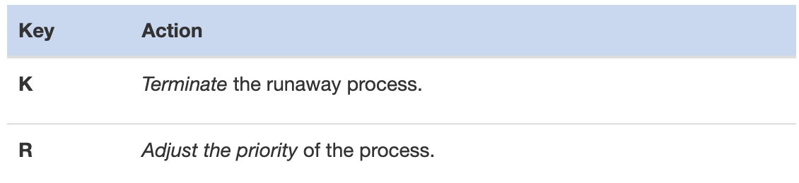
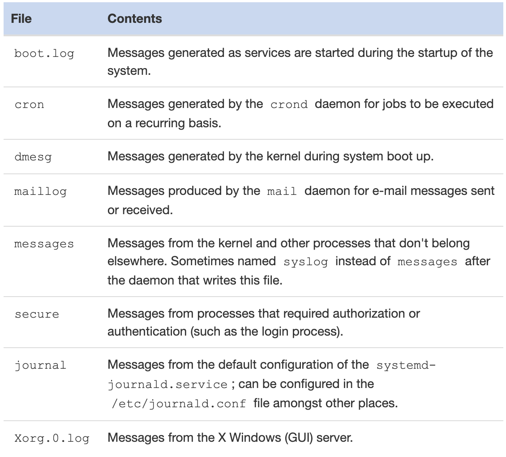
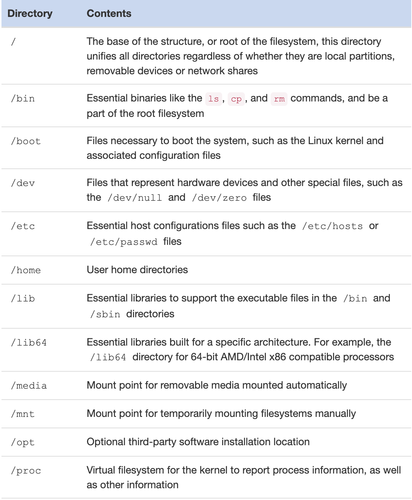
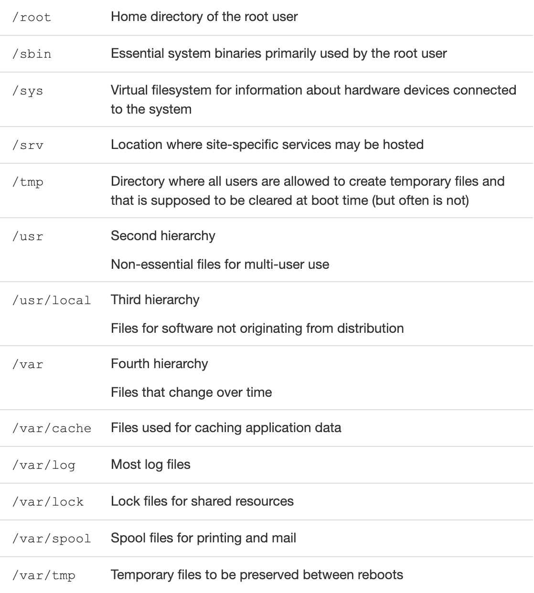

# Where Data is Stored

This section explores where and how data is stored in a Linux system, including information about processes, memory management, log files, and the filesystem hierarchy. Understanding these storage structures is crucial for system monitoring, troubleshooting, and administration.

## Table of Contents

- [Processes](#processes)
  - [Processes Hierarchy](#processes-hierarchy)
  - [Viewing Process Snapshot](#viewing-process-snapshot)
  - [Viewing Processes in Real Time](#viewing-processes-in-real-time)
- [Memory](#memory)
  - [Viewing Memory](#viewing-memory)
- [Log Files](#log-files)
  - [Kernel messages](#kernel-messages)
- [Filesystem Hierarchy Standard](#filesystem-hierarchy-standard)
  - [User Home Directories](#user-home-directories)
  - [Binary Directories](#binary-directories)
  - [Software Application Directories](#software-application-directories)
  - [Library Directories](#library-directories)
  - [Variable Data Directories](#variable-data-directories)

---

## Processes
The kernel provides access to information about active processes through a pseudo filesystem that is visible under the `/proc` directory.

The `/proc` directory is read, and its information utilized by many different commands on the system, including but not limited to `top`, `free`, `mount`, `umount` and many many others. It is rarely necessary for a user to mine the `/proc` directory directly—it’s easier to use the commands that utilize its information.

```bash
sysadmin@localhost:~$ ls /proc
1          cpuinfo      irq          modules       sys
128        crypto       kallsyms     mounts        sysrq-trigger
17         devices      kcore        mtrr          sysvipc
21         diskstats    key-users    net           thread-self 
23         dma          keys         pagetypeinfo  timer_list
39         driver       kmsg         partitions    timer_stats
60         execdomains  kpagecgroup  sched_debug   tty
72         fb           kpagecount   schedstat     uptime
acpi       filesystems  kpageflags   scsi          version
buddyinfo  fs           loadavg      self          version_signature
bus        interrupts   locks        slabinfo      vmallocinfo
cgroups    iomem        mdstat       softirqs      vmstat
cmdline    ioports      meminfo      stat          zoneinfo
con
soles   ipmi         misc         swaps
```

The output shows a variety of named and numbered directories. There is a numbered directory for each running process on the system, where the name of the directory matches the process ID (PID) for the running process.

For example, the numerals 72 denote PID 72, a running program, which is represented by a directory of the same name, containing many files and subdirectories that describe that running process, it’s configuration, use of memory, and many other items.

On a running Linux system, there is always a process ID or PID 1.


### Processes Hierarchy 
As either of the init processes starts up other processes, they, in turn, may start up processes, which may start up other processes, on and on. When one process starts another process, the process that performs the starting is called the parent process and the process that is started is called the child process. When viewing processes, the parent PID is labeled PPID.

When the system has been running for a long time, it may eventually reach the maximum PID value, which can be viewed and configured through the `/proc/sys/kernel/pid_max` file.

Processes can be “mapped” into a family tree of parent and child couplings. If you want to view this tree, the command `pstree` displays it.

### Viewing Process Snapshot

Another way of viewing processes is with the `ps` command. By default, the `ps` command only shows the current processes running in the current shell.

If you run `ps` with the option **--forest**, then, similar to the pstree command, it shows lines indicating the parent and child relationship. 

To be able to view all processes on the system execute either the `ps aux` command or the `ps -ef` command. 

A common way to reduce the number of lines of output that the user might have to sort through is to use the `grep` command to filter the output display lines that match a keyword, such as a process name. For example, to only view information about the firefox process, execute a command like:

```bash
sysadmin@localhost:~$ ps -ef | grep firefox
 6090 pts/0    00:00:07 firefox
```

There are several styles of options that the ps command supports, resulting in different ways to view an individual user's processes. To use the traditional UNIX option to view the processes of a specific user, use the **-u** option:

```bash
sysadmin@localhost:~$ ps -u root
  PID TTY          TIME CMD
    1 ?        00:00:00 init
   13 ?        00:00:00 cron
   15 ?        00:00:00 sshd
   43 ?        00:00:00 login
```

### Viewing Processes in Real Time

Whereas the `ps` command provides a snapshot of the processes running at the instant the command is executed, the `top` command has a dynamic, screen-based interface that regularly updates the output of running processes.
```bash
sysadmin@localhost:~$ top
```

By default, the output of the `top` command is sorted by the percentage % of CPU time that each process is currently using, with the higher values listed first, meaning more CPU-intensive processes are listed first. 

If a process begins to dominate, or run away with the system, then by default it will appear at the top of the list presented by the `top` command. An administrator that is running the top command can then take one of two actions:



Pressing the **K** key while the top command is running will prompt the user to provide the PID and then a signal number. Sending the default signal requests the process terminate, but sending signal number 9, the KILL signal, forces the process to terminate.

Pressing the **R** key while the top command is running will prompt the user for the process to renice, and then for a niceness value. Niceness values can range from -20 to 19, and affect priority. Only the root user can use a niceness value that is a lower number than the current one, or a negative niceness value, which causes the process to run with an increased priority. Any user can provide a niceness value that is higher than the current niceness value, which causes the process to run with a lowered priority.

The load averages shown in the first line of output from the top command indicate how busy the system has been during the last one, five and fifteen minutes. This information can also be viewed by executing the uptime command or directly by displaying the contents of the `/proc/loadavg` file:
```bash
sysadmin@localhost:~$ cat /proc/loadavg
0.12 0.46 0.25 1/254 3052
```
- **Load Average**. The first three numbers in this file indicate the load average over the last one, five and fifteen minute intervals.
- **Number of Processes**. The fourth value is a fraction which shows the number of processes currently executing code on the CPU **1** and the total number of processes **254**.
- **Last PID**. The fifth value is the last PID value that executed code on the CPU.

The number reported as a load average is proportional to the number of CPU cores that are able to execute processes. On a single-core CPU, a value of one (1) would mean that the system is fully-loaded. On a four core CPU, a value of 1 would mean that the system is only 1/4 or 25% loaded.

Another reason administrators like to keep the top command running is the ability to monitor memory usage in real-time. Both the top and the free command display statistics for how overall memory is being used.

The top command can also show the percentage of memory used by each process, so a process that is consuming an inordinate amount of memory can quickly be identified.

## Memory
Memory on a modern Linux system is governed and managed by the kernel. The hardware memory on the system is shared by all the processes on the system, through a method called virtual addressing.

It’s important to note the difference between user space and kernel space. Kernel space is where code for the kernel is stored and executed. This is generally in a “protected” range of memory addresses and remains isolated from other processes with lower privileges. User space, on the other hand, is available to users and programs. They communicate with the Kernel through “system call” APIs that act as intermediaries between regular programs and the Kernel. This system of separating potentially unstable or malicious programs from the critical work of the Kernel is what gives Linux systems the stability and resilience that application developers rely on.

### Viewing Memory 

Executing the `free` command without any options provides a snapshot of the memory being used at that moment.

If you want to monitor memory usage over time with the free command, then you can execute it with the **-s** option (how often to update) and specify that number of seconds. For example, executing the following free command would update the output every ten seconds: 
```bash
sysadmin@localhost:~$ free -s 10
              total        used        free      shared  buff/cache   available
Mem:      132014640    47304084    77189512        3008     7521044    84085528
Swap:     134196220       42544   134153676

              total        used        free      shared  buff/cache   available
Mem:      132014640    47302928    77190668        3008     7521044    84086684
Swap:     134196220       42544   134153676
```

To make it easier to interpret what the `free` command is outputting, the **-m** or **-g** options can be useful by showing the output in either megabytes or gigabytes, respectively. Without these options, the output is displayed in bytes.

When reading the output of the `free` command:

- **Descriptive Header** First Line
- **Physical Memory Statistics** Second Line
- **Memory Adjustment** The third line represents the amount of physical memory after adjusting those values by not taking into account any memory that is in use by the kernel for buffers and caches. Technically, this "used" memory could be "reclaimed" if needed.
- **Swap Memory** The fourth line of output refers to swap memory, also known as virtual memory. This is space on the hard disk that is used like physical memory when the amount of physical memory becomes low. Effectively, this makes it seem that the system has more memory than it does, but using swap space can also slow down the system. 

If the amount of memory and swap that is available becomes very low, then the system will begin to automatically terminate processes, making it critical to monitor the system's memory usage. An administrator that notices the system becoming low on free memory can use `top` or `kill` to terminate the processes of their own choice, rather than letting the system choose.

## Log Files 

As the kernel and various processes run on the system, they produce output that describes how they are running. Some of this output is displayed as standard output and error in the terminal window where the process was executed, though some of this data is not sent to the screen. Instead, it is written to various files. This information is called log data or log messages.

Regardless of what the daemon process being used, the log files themselves are almost always placed into the /var/log directory structure. Although some of the file names may vary, here are some of the more common files to be found in this directory:


You can view the contents of various log files using two different methods. First, as with most other files, you can use the `cat` command, or the `less` command to allow for searching, scrolling and other options.

## Kernel messages

The `/var/log/dmesg` file contains the kernel messages that were produced during system startup. The `/var/log/messages` file contains kernel messages that are produced as the system is running, but those messages are mixed in with other messages from daemons or processes.

Although the kernel doesn't have its own log file normally, one can be configured for it by modifying either the `/etc/syslog.conf` file or the `/etc/rsyslog.conf` file. In addition, the `dmesg` command can be used to view the kernel ring buffer, which holds a large number of messages that are generated by the kernel.‌⁠​​⁠​
Executing the dmesg command can produce up to 512 kilobytes of text, so filtering the command with a pipe to another command like `less` or `grep` is recommended.

```bash
sysadmin@localhost:~$ dmesg | grep -i usb
```

## Filesystem Hierarchy Standard 

Among the standards supported by the Linux Foundation is the **Filesystem Hierarchy Standard (FHS)**.

A standard is a set of rules or guidelines that it is recommended to follow. However, these guidelines certainly can be broken. 

The FHS standard categorizes each system directory in a couple of ways:
    - A directory can be categorized as either shareable or not, referring to whether the directory can be shared on a network and used by multiple machines.
    - The directory is put into a category of having either static files (file contents won't change) or variable files (file contents can change).

To make these classifications, it is often necessary to refer to subdirectories below the top level of directories. For example, the /var directory itself cannot be categorized as either shareable or not shareable, but one of its subdirectories, the /var/mail directory, is shareable. Conversely, the /var/lock directory should not be shareable.

The FHS standard defines four hierarchies of directories used in organizing the files of the filesystem. The top-level or root hierarchy follows:




The second and third hierarchies, located under the `/usr` and `/usr/local` directories, repeat the pattern of many of the key directories found under the first hierarchy or root filesystem. The fourth hierarchy, the `/var` directory, also repeats some of the top-level directories such as `lib, opt and tmp`.

The `/usr` directory is intended to hold software for use by multiple users. The `/usr` directory is sometimes shared over the network and mounted as read-only.

The `/usr/local` hierarchy is for installation of software that does not originate with the distribution. Often this directory is used for software that is compiled from the source code.

### Organization Within the Filesystem Hierarchy

#### User Home Directories

The `/home` directory has a directory underneath it for each user account. For example, a user bob will have a home directory of `/home/bob`. Typically, only the user bob will have access to this directory. Without being assigned special permissions on other directories, a user can only create files in their home directory, the `/tmp` directory, and the `/var/tmp` directory.

#### Binary Directories

Binary directories contain the programs that users and administrators execute to start processes or applications running on the system.

#### User-Specific Binaries

The binary directories that are intended to be used by non-privileged users include:
- /bin
- /usr/bin
- /usr/local/bin

Sometimes third-party software also store their executable files in directories such as:
- /usr/local/application/bin
- /opt/application/bin

In addition, it is not unusual for each user to have their own bin directory located in their home directory; for example, `/home/bob/bin`.

#### Root-Restricted Binaries

On the other hand, the `sbin` directories are primarily intended to be used by the system administrator (the root user). These usually include:
- /sbin
- /usr/sbin
- /usr/local/sbin

Some third-party administrative applications could also use directories such as:
- /usr/local/application/sbin
- /opt/application/sbin

Depending on the distribution, the **PATH** variable may not contain all of the possible **bin** and **sbin** directories. To execute a command in one of these directories, the directory needs to be included in the PATH variable list, or the user needs to specify the path to the command.

#### Software Application Directories
Applications in Linux may have their files in multiple directories spread out throughout the Linux filesystem.

The executable program binary files may go in the `/usr/bin` directory if they are included with the operating system, or else they may go into the `/usr/local/bin` or `/opt/application/bin ` directories if they came from a third party.

The data for the application may be stored in one of the following subdirectories:
- /usr/share
- /usr/lib
- /opt/application
- /var/lib

The file related to documentation may be stored in one of the following subdirectories:
- /usr/share/doc
- /usr/share/man
- /usr/share/info

The global configuration files for an application are most likely to be stored in a subdirectory under the /etc directory, while the personalized configuration files (specific for a user) for the application are probably in a hidden subdirectory of the user's home directory.

#### Library Directories

Libraries are files which contain code that is shared between multiple programs. Most library file names end in a file extension of **.so**, which means shared object.

The libraries that support the essential binary programs found in the `/bin` and `/sbin` directories are typically located in either `/lib` or `/lib64`.

To support the `/usr/bin` and `/usr/sbin` executables, the `/usr/lib` and `/usr/lib64` library directories are typically used.

For supporting applications that are not distributed with the operating system, the `/usr/local/lib` and `/opt/application/lib` library directories are frequently used.

#### Variable Data Directories

The `/var` directory and many of its subdirectories can contain data that changes frequently. If your system is used for email, then either `/var/mail` or `/var/spool/mail` is normally used to store users' email data. 

Depending on what events are being logged and how much activity is occurring, the system determines how large your log file becomes. On a busy system, there could be a considerable amount of data in the log files. These files are stored in the `/var/log` directory.

While the log files can be handy for troubleshooting problems, they can cause problems. One major concern for all of these directories is that they can fill up the disk space quickly on an active system. If the `/var` directory is not a separate partition, then the root filesystem could become full and cause the system to crash.


    